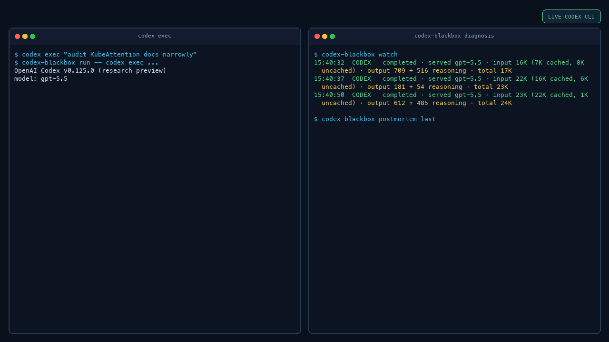

# Codex Blackbox

Codex runs can be hard to judge after the fact.

It may finish, but you still do not know what happened: which model answered,
whether the response actually completed, how many tokens were used, whether
cached input helped, or whether the run is worth continuing.

Codex Blackbox gives you a local postmortem for a Codex CLI session. It turns
the run into a short report with the outcome, model, token use, cost estimate,
important signals, and a practical next step.

It is built for local debugging. The database, metrics, dashboard, and CLI run
on your machine.



## Quick Start

Install:

```bash
curl -fsSL https://raw.githubusercontent.com/softcane/codex-blackbox/main/install.sh | sh
```

Start the local stack:

```bash
codex-blackbox doctor
codex-blackbox up
```

Run Codex normally through the wrapper:

```bash
codex-blackbox run --watch -- codex
```

Read the latest report:

```bash
codex-blackbox postmortem last
```

For a quick one-shot check instead of an interactive Codex session:

```bash
codex-blackbox run --watch -- codex exec --sandbox read-only "Read README.md and summarize this repo. Do not edit files."
```

Open Grafana:

[http://127.0.0.1:3000/d/codex-blackbox-main](http://127.0.0.1:3000/d/codex-blackbox-main)

## What You Get

The postmortem is redacted by default. It shows:

- the session id
- whether the run completed, failed, or ended incomplete
- the requested model and served model
- input, cached input, uncached input, output, and reasoning tokens
- local token and cost estimates
- important signals, like high context use or model mismatch
- tool calls the model tried to make

Example:

```markdown
# Codex Responses Postmortem

## Snapshot
- Session: 019e0743-63c2-7c61-b326-8088e4ae0c7b
- State: final or persisted snapshot
- Outcome: Likely Completed
- Requested Model: gpt-5.5
- Served Model: gpt-5.5
- Turns: 3
- Tokens: input 54231, cached 41600, uncached 12631, output 610, reasoning 445, local total 54841
- Local Estimate: $0.10

## Recommendations
- Continue from the latest response summary if it matches the intended task.
```

For a specific session:

```bash
codex-blackbox postmortem <session_id>
```

For local debugging without redaction:

```bash
codex-blackbox postmortem last --no-redact
```

To write the report to a file:

```bash
codex-blackbox postmortem last --output report.md
```

## What It Can Tell You

Codex Blackbox can report what it observed during the model run:

- did the model response complete, fail, or stop incomplete?
- which model was requested, and which model answered?
- how many input, cached input, uncached input, output, and reasoning tokens
  were used?
- what was the local cost estimate?
- did the run show context pressure, model mismatch, or accounting oddities?
- which tools did the model try to call?

## Common Commands

```bash
codex-blackbox doctor
codex-blackbox up
codex-blackbox watch --url http://127.0.0.1:9091
codex-blackbox sessions --limit 20 --days 7
codex-blackbox postmortem last
codex-blackbox postmortem last --no-redact
```

API shortcuts:

```bash
curl -s 'http://127.0.0.1:9091/api/sessions?limit=5'
curl -s 'http://127.0.0.1:9091/api/postmortem/last'
curl -s http://127.0.0.1:9091/metrics
```

## Testing

Local fake tests:

```bash
./test/validate-openai-config.sh
./test/e2e-openai-responses-full.sh
```

These tests use fake Responses fixtures. They do not contact OpenAI, and they
do not prove live Codex support.

Live or dogfood evidence means a real Codex CLI run went through
`codex-blackbox run -- codex ...` and Codex Blackbox saved at least one real
Codex Responses request for that run.

## Development

Developer notes:

[docs/reference/developing.md](docs/reference/developing.md)
