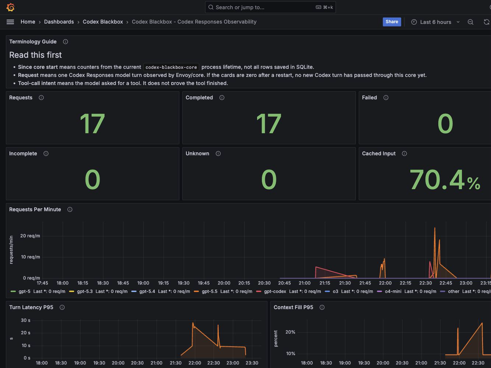

# Codex Blackbox

[Open the dashboard](http://127.0.0.1:3000/d/codex-blackbox-main/codex-blackbox-codex-responses-observability?orgId=1&refresh=30s) after `codex-blackbox up`.

Codex Blackbox is a local flight recorder for Codex CLI sessions. It records
observed Codex Responses turns and shows a live dashboard, watch stream, status
decision, guard decision, and redacted postmortem.

When Codex is working for a while, you should be able to see whether it is
making progress, spending tokens, filling context, switching models, or ending
in a failed or incomplete response.



## Install

Install a published release:

```bash
curl -fsSL https://raw.githubusercontent.com/softcane/codex-blackbox/main/install.sh | sh
```

Install from source when you want the current checkout:

```bash
git clone https://github.com/softcane/codex-blackbox.git
cd codex-blackbox
cargo install --path codex-blackbox-cli
```

Requirements:

- Docker Desktop or Docker Engine.
- Docker Compose v2, or `docker-compose`.
- Codex CLI.
- A Codex ChatGPT login for subscription mode.

## Start With Your Own Session

Use this when you want to visualize a live Codex session:

```bash
codex-blackbox up
codex-blackbox run codex
```

Add `--watch` when you want a terminal stream beside the dashboard:

```bash
codex-blackbox run --watch codex
```

Then open:

```text
http://127.0.0.1:3000/d/codex-blackbox-main/codex-blackbox-codex-responses-observability?orgId=1&refresh=30s
```

The top dashboard cards are for the current `codex-blackbox-core` process
lifetime. If you restart the stack, those cards start at zero again. Saved run
evidence still lives in SQLite and in postmortems.

## What You Get

- Live Grafana dashboard for observed Codex Responses traffic.
- Prometheus metrics with bounded, privacy-safe labels.
- `watch` output for session start, turn summaries, context status, model
  fallback, tool-call intent, and postmortem readiness.
- `status` and `guard` decisions from the same local decision object.
- Redacted `postmortem` reports with per-turn token and response evidence.
- SQLite persistence for observed Codex turns with `provider="codex_responses"`.

Tool-call panels show model-side intent only. They do not prove a local tool ran
or completed.

## Confirm The Machine

```bash
codex-blackbox doctor
```

`doctor` checks local prerequisites and stack health. It does not launch a
Codex model turn.

## Start The Stack

```bash
codex-blackbox up
```

After `up`, these local pages are available:

- Dashboard: `http://127.0.0.1:3000/d/codex-blackbox-main`
- Prometheus: `http://127.0.0.1:9092`
- Metrics endpoint: `http://127.0.0.1:9091/metrics`

From a release install, `codex-blackbox up` writes its bundled Compose files
under the Codex Blackbox data directory. From the repository, it uses the
repository `docker-compose.yml`.

## Run Codex Through Blackbox

Anything after `run` is the Codex command you already use:

```bash
codex-blackbox run codex
```

For a watched run:

```bash
codex-blackbox run --watch codex
```

The wrapper uses command-line config overrides for the child Codex process. It
does not edit `~/.codex/config.toml`, and it does not inject `--ephemeral`.

Preview those overrides without launching Codex:

```bash
codex-blackbox config codex
```

## Experimental Codex UI Routing

Codex Desktop/UI routing is manual and experimental. The release installer does
not enable it, and `codex-blackbox run` still does not edit
`~/.codex/config.toml`.

Use this only if you are comfortable changing global Codex config. Start the
stack first:

```bash
codex-blackbox up
```

Back up `~/.codex/config.toml`, then add these root-level keys before any
`[section]` header:

```toml
chatgpt_base_url = "http://127.0.0.1:10000/backend-api"
model_provider = "openai_custom"
```

Add the provider definition:

```toml
[model_providers.openai_custom]
name = "OpenAI"
base_url = "http://127.0.0.1:10000/backend-api/codex"
wire_api = "responses"
requires_openai_auth = true
supports_websockets = false
```

Disable request compression. If `[features]` already exists, add the key there
instead of creating a second `[features]` table:

```toml
[features]
enable_request_compression = false
```

Restart Codex Desktop/UI after editing the config. In a local smoke test, this
routed UI model turns through:

```text
/backend-api/codex/responses
```

and produced `provider="codex_responses"` watch and metrics evidence.

Gotchas:

- `model_provider = "openai_custom"` changes the active provider identity. Past
  Codex UI sessions may appear missing while that provider is active; they are
  expected to reappear when you switch back to your original provider config.
- If `codex-blackbox up` is not running, Codex UI requests that depend on the
  proxy can fail.
- This is not a `codex-blackbox ui enable` feature yet. Disable it by removing
  the manual `chatgpt_base_url`, `model_provider`, and
  `[model_providers.openai_custom]` entries, or by restoring your backup, then
  restart Codex.

Verify the route while submitting one small UI prompt:

```bash
codex-blackbox watch
curl -fsS http://127.0.0.1:9091/metrics | grep 'provider="codex_responses"'
```

## Read The Session

After or during a run:

```bash
codex-blackbox watch
codex-blackbox status
codex-blackbox guard --json
codex-blackbox postmortem last
```

What each command is for:

- `watch`: live stream of observed session events.
- `status`: compact local decision for the latest or selected session.
- `guard`: advisory decision for the next request; it cannot interrupt an
  already-streaming response.
- `postmortem`: deterministic local report for a completed session.

Decision states use the same semantics across `status`, `guard`, `watch`, and
postmortem output:

- `Watching`: no durable Codex Responses turn has been observed yet.
- `Healthy`: continue.
- `Careful`: continue narrowly.
- `Stop`: inspect before spending another turn.
- `Blocked`: local policy says the next request should not run.
- `Cooldown`: wait before retrying.
- `Ended`: the session is ready for review.

## Dashboard Notes

The dashboard is for current-process observability. It is useful for screenshots
and live monitoring, but it is not a complete historical report.

Use it for:

- request and response status counts
- request rate
- p95 turn latency
- p95 context fill
- token volume by model and token kind
- model fallback
- tool-call intent
- guard blocks
- diagnostic causes

Token accounting follows the Codex Responses rules:

- cached input is part of input
- uncached input is `input - cached_input`
- reasoning output is output-side detail
- local total tokens are `input + output`

## Commands

These are the enabled commands documented here:

```bash
codex-blackbox doctor
codex-blackbox up
codex-blackbox run codex
codex-blackbox run --watch codex
codex-blackbox config codex
codex-blackbox watch
codex-blackbox status
codex-blackbox guard
codex-blackbox postmortem last
```

Architecture and development notes live in [ARCHITECTURE.md](ARCHITECTURE.md)
and [docs/index.md](docs/index.md).
